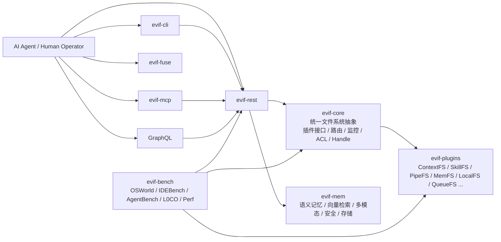
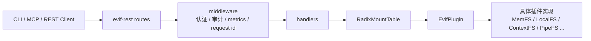
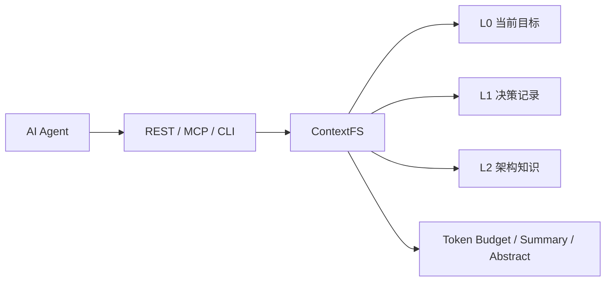
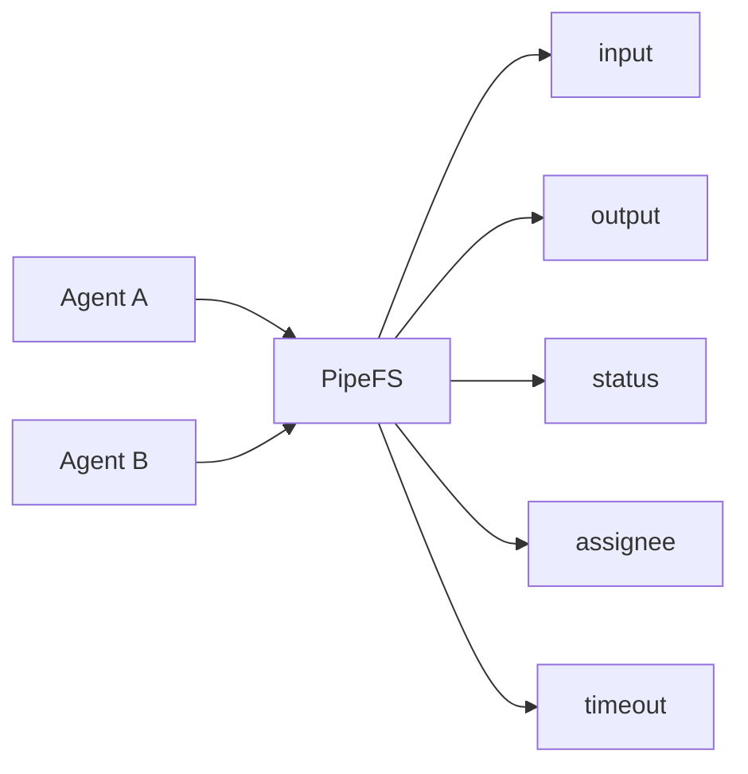
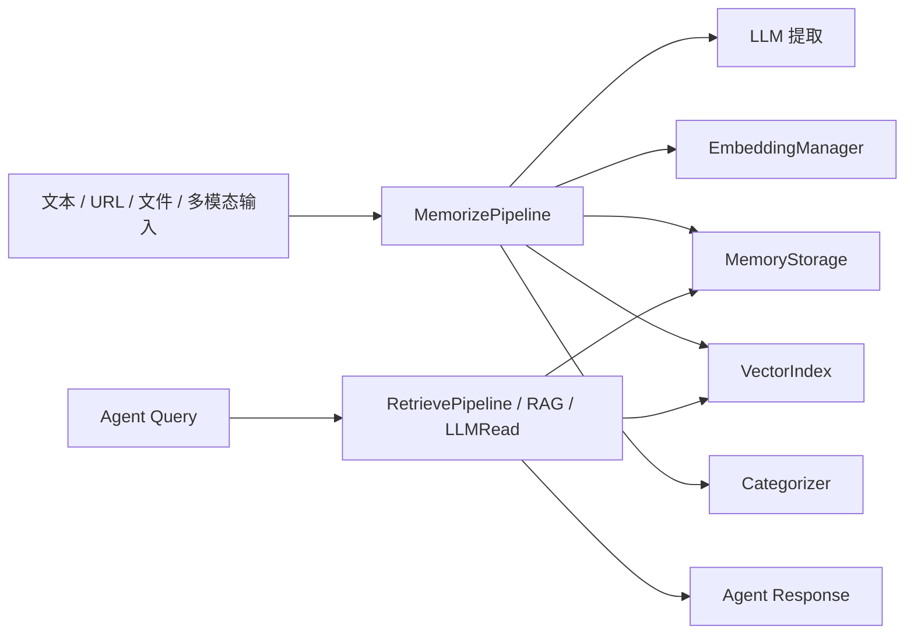

# EVIF 核心能力地图

> 生成时间：2026-04-05
> 依据：真实代码阅读 + 真实命令执行
> 范围：`evif-core` / `evif-plugins` / `evif-rest` / `evif-mcp` / `evif-mem` / `evif-bench`

## 1. 执行口径

本报告不是只基于静态阅读得出，而是结合以下真实执行结果整理：

- `cargo clippy --workspace --all-targets -- -D warnings`
- `cargo test --workspace --all-targets -- --nocapture`
- `cargo run -p evif-rest`
- `curl http://127.0.0.1:8081/api/v1/health`
- `curl 'http://127.0.0.1:8081/api/v1/directories?path=/'`
- `curl 'http://127.0.0.1:8081/api/v1/files?path=/context/L2/architecture.md'`
- `curl 'http://127.0.0.1:8081/api/v1/files?path=/skills/code-review/SKILL.md'`
- `curl -H 'x-api-key: write-key' -H 'content-type: application/json' -d '{"path":"/pipes/analysis-task"}' http://127.0.0.1:8081/api/v1/directories`
- `curl -X PUT -H 'x-api-key: write-key' -H 'content-type: application/json' -d '{"data":"analyze repository deeply","encoding":null}' 'http://127.0.0.1:8081/api/v1/files?path=/pipes/analysis-task/input'`
- `curl 'http://127.0.0.1:8081/api/v1/files?path=/pipes/analysis-task/status'`
- `cargo run -p evif-cli -- --server http://127.0.0.1:8081 health`
- `cargo run -p evif-cli -- --server http://127.0.0.1:8081 ls /`
- `cargo run -p evif-mcp -- --help`

真实执行中确认：

- workspace `clippy` 退出 `0`
- workspace `test` 退出 `0`
- `evif-rest` 默认真实挂载 `/context`、`/skills`、`/pipes`
- `/pipes/analysis-task/input` 写入后，`status` 真实变为 `running`
- `evif-cli` 可直接操作运行中的 EVIF 服务
- `evif-mcp` 启动后真实加载 26 个工具

## 2. 总体能力图

## 3. 模块边界

### 3.1 `evif-core`

职责：

- 定义统一插件接口 `EvifPlugin`
- 定义 `FileHandle` / `HandleFS`
- 提供挂载路由 `RadixMountTable`
- 提供 ACL、批量操作、缓存、文件锁、监控、动态插件加载

边界：

- 不直接表达业务语义
- 不面向某一类 agent workflow
- 负责把任意插件能力统一成文件系统行为

代码落点：

- [plugin.rs](/Users/louloulin/Documents/linchong/claude/evif/crates/evif-core/src/plugin.rs)
- [radix_mount_table.rs](/Users/louloulin/Documents/linchong/claude/evif/crates/evif-core/src/radix_mount_table.rs)
- [lib.rs](/Users/louloulin/Documents/linchong/claude/evif/crates/evif-core/src/lib.rs)

关键判断：

- `evif-core` 是 EVIF 的“内核 ABI”
- 它解决的是“怎样把不同能力统一到同一个路径空间”
- 它不是一个通用 web backend，而是一个虚拟文件系统 runtime

### 3.2 `evif-plugins`

职责：

- 把不同能力落成可挂载文件系统
- 承担最有 agent 特征的语义插件

核心插件：

- `ContextFS`
- `SkillFS`
- `PipeFS`
- `MemFS`
- `LocalFS`
- `QueueFS`
- `HandleFS`
- `EncryptedFS`
- `HTTPFS`
- `ProxyFS`

代码落点：

- [lib.rs](/Users/louloulin/Documents/linchong/claude/evif/crates/evif-plugins/src/lib.rs)
- [contextfs.rs](/Users/louloulin/Documents/linchong/claude/evif/crates/evif-plugins/src/contextfs.rs)
- [skillfs.rs](/Users/louloulin/Documents/linchong/claude/evif/crates/evif-plugins/src/skillfs.rs)
- [pipefs.rs](/Users/louloulin/Documents/linchong/claude/evif/crates/evif-plugins/src/pipefs.rs)

关键判断：

- `evif-plugins` 承担了 EVIF 的产品语义
- 其中 `/context`、`/skills`、`/pipes` 是最核心的 agent-native surface

### 3.3 `evif-rest`

职责：

- 作为统一数据面和控制面
- 把文件操作、挂载、加密、同步、租户、记忆、GraphQL、协作等能力收敛到 HTTP
- 负责认证、审计、metrics、request identity、生产配置校验

代码落点：

- [routes.rs](/Users/louloulin/Documents/linchong/claude/evif/crates/evif-rest/src/routes.rs)
- [server.rs](/Users/louloulin/Documents/linchong/claude/evif/crates/evif-rest/src/server.rs)
- [middleware.rs](/Users/louloulin/Documents/linchong/claude/evif/crates/evif-rest/src/middleware.rs)

关键判断：

- `evif-rest` 不是薄适配层，而是运行时汇聚层
- 对外统一了文件面、控制面、运行态状态面
- 当前已经具备生产候选级的控制链路

### 3.4 `evif-mcp`

职责：

- 把 EVIF 的能力映射为 MCP 工具、资源、prompt
- 连接 Claude Desktop / Codex / 其他 MCP 客户端

代码落点：

- [lib.rs](/Users/louloulin/Documents/linchong/claude/evif/crates/evif-mcp/src/lib.rs)

关键判断：

- `evif-mcp` 不是把现有 REST 包一层而已
- 它是在做 agent runtime 的工具暴露层
- 真实运行时加载了 26 个工具，说明接入面已经较完整

### 3.5 `evif-mem`

职责：

- 提供 AI 原生记忆平台
- 包含提取、嵌入、向量检索、分类、强化、多模态、proactive 提取、安全、telemetry

代码落点：

- [lib.rs](/Users/louloulin/Documents/linchong/claude/evif/crates/evif-mem/src/lib.rs)
- [pipeline.rs](/Users/louloulin/Documents/linchong/claude/evif/crates/evif-mem/src/pipeline.rs)

关键判断：

- `evif-mem` 使 EVIF 不只是“能操作文件”
- 它让 EVIF 变成“能支撑 agent 长期记忆与语义检索”的底座

### 3.6 `evif-bench`

职责：

- 给 agent 能力和系统能力提供评测框架
- 覆盖 OSWorld、IDEBench、AgentBench、L0CO、性能基准

代码落点：

- [lib.rs](/Users/louloulin/Documents/linchong/claude/evif/crates/evif-bench/src/lib.rs)
- [agentbench.rs](/Users/louloulin/Documents/linchong/claude/evif/crates/evif-bench/src/agentbench.rs)

关键判断：

- `evif-bench` 让 EVIF 有“价值证明机制”
- 这比只有功能、没有 benchmark 的 infra 更接近平台形态

## 4. 核心数据流

### 4.1 文件操作数据流

说明：

- 接入层可以多样
- 真正的路径路由落在 `RadixMountTable`
- 插件接口是统一执行边界

### 4.2 Agent 上下文数据流

说明：

- 上下文不只是 prompt string
- EVIF 将其显式落成可读写文件层
- 这使上下文可以被共享、持久化、压缩、回放

### 4.3 技能发现与执行数据流

说明：

- Skill 不再只是散乱 Markdown
- 它具备结构化校验、匹配与执行链路

### 4.4 多 Agent 协作数据流

说明：

- Pipe 是显式协作协议
- 真实运行中，写入 `/pipes/analysis-task/input` 后，`status` 变为 `running`

### 4.5 记忆处理数据流

说明：

- `evif-mem` 是一条独立的智能数据流
- 它不是普通 KV storage，而是 memory processing system

## 5. 从真实运行看到的边界

### `core` 的边界

- 提供统一插件 ABI
- 不承载高层产品语义
- 是一切能力接入的稳定底座

### `plugins` 的边界

- 把语义落成文件系统
- 决定“agent 看到的世界长什么样”

### `rest` 的边界

- 提供统一外部控制面
- 将系统状态和插件能力变成可远程操作的合同

### `mcp` 的边界

- 不实现核心业务
- 负责把 EVIF 的文件系统世界映射成 agent tool world

### `mem` 的边界

- 不负责挂载与路由
- 负责长期记忆、语义检索与多模态提取

### `bench` 的边界

- 不服务生产路径
- 负责证明系统在 agent 任务中的效果和稳定性

## 6. 对 AI Agent 最重要的能力组合

最关键的不是单一模块，而是这组组合：

1. `RadixMountTable + EvifPlugin`
2. `ContextFS + SkillFS + PipeFS`
3. `REST + CLI + MCP`
4. `Memory + Benchmark`

这组组合带来的结果是：

- agent 拿到的是“统一运行时”
- 而不是“很多零散工具”

## 7. 当前最有价值的结论

EVIF 的核心能力边界已经比较清楚：

- `core` 解决统一抽象
- `plugins` 解决语义落地
- `rest` 解决外部可操作性
- `mcp` 解决 agent tool 接入
- `mem` 解决长期智能记忆
- `bench` 解决价值验证

因此 EVIF 的本质不是“一个文件 API 服务”，而是：

> 一个把 AI Agent 工作流抽象为文件系统语义、并通过多接入面暴露出来的运行时平台。
