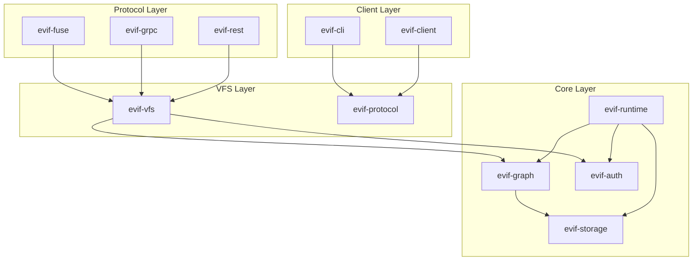
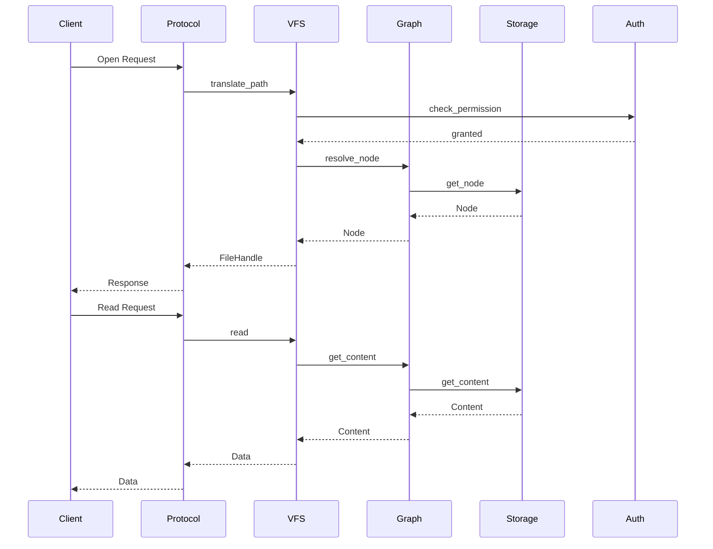
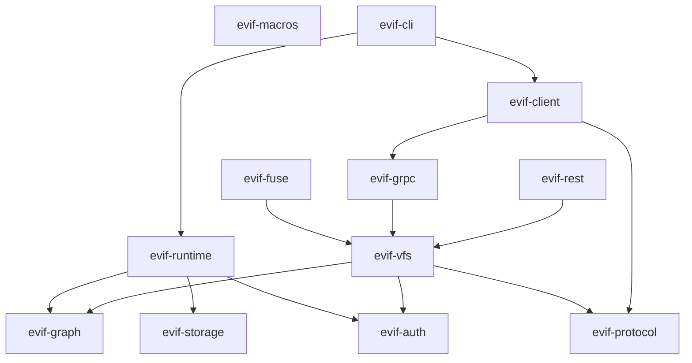

# EVIF (Everything Is a File) - Comprehensive Development Plan

## Project Overview

**EVIF (Everything Is a File)** is an abstract graph-based file system implemented in Rust, inspired by Plan 9's philosophy and modern distributed file system architectures. The system treats all resources (files, directories, devices, processes, network connections) as files in a unified graph structure.

### Core Philosophy
- **Unified Abstraction**: All resources accessible through file-like interfaces
- **Graph-Based Organization**: Nodes and edges representing complex relationships
- **High Cohesion, Low Coupling**: Modular crate architecture with clear boundaries
- **Type Safety**: Leverage Rust's type system for correctness
- **Async-First**: Built on Tokio for high-performance I/O

---

## Architecture Overview

### System Architecture Diagram

```
┌─────────────────────────────────────────────────────────────────────────────┐
│                              EVIF System Layer                               │
├─────────────────────────────────────────────────────────────────────────────┤
│                                                                             │
│  ┌──────────────────┐  ┌──────────────────┐  ┌──────────────────┐        │
│  │  FUSE Client     │  │  gRPC Client     │  │  REST Client     │        │
│  │  (Linux/BSD)     │  │  (Distributed)   │  │  (HTTP/JSON)     │        │
│  └────────┬─────────┘  └────────┬─────────┘  └────────┬─────────┘        │
│           │                     │                     │                    │
│           └─────────────────────┼─────────────────────┘                    │
│                                 │                                          │
│                    ┌────────────▼────────────┐                             │
│                    │    Protocol Layer       │                             │
│                    │  (evif-protocol)        │                             │
│                    └────────────┬────────────┘                             │
│                                 │                                          │
│                    ┌────────────▼────────────┐                             │
│                    │    VFS Abstraction      │                             │
│                    │  (evif-vfs)             │                             │
│                    └────────────┬────────────┘                             │
│                                 │                                          │
│           ┌─────────────────────┼─────────────────────┐                    │
│           │                     │                     │                    │
│  ┌────────▼─────────┐  ┌────────▼─────────┐  ┌────────▼─────────┐        │
│  │  Graph Engine    │  │  Storage Layer   │  │  Security Layer  │        │
│  │  (evif-graph)    │  │  (evif-storage)  │  │  (evif-auth)     │        │
│  └────────┬─────────┘  └────────┬─────────┘  └────────┬─────────┘        │
│           │                     │                     │                    │
│           └─────────────────────┼─────────────────────┘                    │
│                                 │                                          │
│                    ┌────────────▼────────────┐                             │
│                    │    Runtime Core         │                             │
│                    │  (evif-runtime)         │                             │
│                    └─────────────────────────┘                             │
│                                                                             │
└─────────────────────────────────────────────────────────────────────────────┘
```

### Crate Dependency Graph

```
┌─────────────────────────────────────────────────────────────────────────────┐
│                         Crate Architecture (Mermaid)                         │
├─────────────────────────────────────────────────────────────────────────────┤
│                                                                             │
│  evif-runtime (Core Foundation)                                            │
│  ├── evif-graph (Graph data structures & algorithms)                       │
│  ├── evif-storage (Storage backends & persistence)                         │
│  ├── evif-auth (Authentication & authorization)                            │
│  ├── evif-vfs (Virtual file system abstraction)                           │
│  │   ├── evif-protocol (Wire protocol & serialization)                     │
│  │   ├── evif-fuse (FUSE bindings for POSIX compatibility)                 │
│  │   ├── evif-grpc (gRPC service implementation)                           │
│  │   └── evif-rest (REST/HTTP API)                                         │
│  └── evif-macros (Procedural macros for code generation)                   │
│                                                                             │
│  evif-cli (Command-line tool)                                              │
│  └── Depends on: evif-runtime, evif-client                                 │
│                                                                             │
│  evif-client (Client library)                                              │
│  └── Depends on: evif-protocol, evif-grpc                                  │
│                                                                             │
└─────────────────────────────────────────────────────────────────────────────┘
```

---

## Detailed Crate Architecture

### 1. evif-runtime (Core Foundation)

**Purpose**: Core runtime, configuration, and orchestration

**Responsibilities**:
- System initialization and lifecycle management
- Configuration loading (TOML/JSON)
- Logging and observability setup
- Error handling and recovery
- Resource management (threads, memory pools)

**Key Types**:
```rust
pub struct EvifRuntime {
    config: RuntimeConfig,
    graph_engine: Arc<GraphEngine>,
    storage_manager: Arc<StorageManager>,
    auth_manager: Arc<AuthManager>,
}

pub struct RuntimeConfig {
    pub max_nodes: usize,
    pub max_connections: usize,
    pub storage_backend: StorageConfig,
    pub auth_policy: AuthPolicy,
}
```

**Dependencies**:
- `tokio` (async runtime)
- `tracing` (structured logging)
- `serde` (configuration serialization)
- `config` (config file loading)

---

### 2. evif-graph (Graph Engine)

**Purpose**: Core graph data structures and algorithms

**Design Philosophy**:
- High cohesion: All graph-related operations in one place
- Low coupling: Uses trait-based abstractions for storage and algorithms

**Core Concepts**:

```rust
// Node: Represents any entity (file, directory, device, etc.)
pub struct Node {
    pub id: NodeId,
    pub node_type: NodeType,
    pub metadata: Metadata,
    pub attributes: BTreeMap<String, Attribute>,
    pub content: ContentHandle,
}

// Edge: Represents relationships between nodes
pub struct Edge {
    pub id: EdgeId,
    pub source: NodeId,
    pub target: NodeId,
    pub edge_type: EdgeType,
    pub weight: Option<f64>,
    pub properties: BTreeMap<String, Value>,
}

// Graph: The main graph structure
pub struct Graph {
    nodes: RwLock<HashMap<NodeId, Node>>,
    edges: RwLock<HashMap<EdgeId, Edge>>,
    adjacency_list: RwLock<HashMap<NodeId, Vec<EdgeId>>>,
    index: Arc<dyn GraphIndex>,
}

// GraphIndex: Trait for different indexing strategies
pub trait GraphIndex: Send + Sync {
    fn insert(&mut self, node: &Node) -> Result<()>;
    fn remove(&mut self, id: &NodeId) -> Result<()>;
    fn query(&self, query: &GraphQuery) -> Result<Vec<NodeId>>;
    fn optimize(&mut self) -> Result<()>;
}
```

**Key Algorithms**:
- **Traversal**: BFS, DFS, Dijkstra, A*
- **Query**: Pattern matching, path finding
- **Optimization**: Index building, cache management

**Dependencies**:
- `petgraph` (graph algorithms)
- `rayon` (parallel processing)
- `ahash` (fast hashing)
- `dashmap` (concurrent hash maps)

---

### 3. evif-storage (Storage Layer)

**Purpose**: Abstract storage backends with pluggable implementations

**Design Philosophy**:
- Storage interface: Trait-based abstraction
- Multiple backends: In-memory, sled (embedded), RocksDB, cloud
- Write-ahead logging (WAL) for durability
- Async operations throughout

**Core Traits**:

```rust
#[async_trait]
pub trait StorageBackend: Send + Sync {
    // Node operations
    async fn get_node(&self, id: &NodeId) -> Result<Option<Node>>;
    async fn put_node(&self, node: &Node) -> Result<()>;
    async fn delete_node(&self, id: &NodeId) -> Result<()>;

    // Edge operations
    async fn get_edge(&self, id: &EdgeId) -> Result<Option<Edge>>;
    async fn put_edge(&self, edge: &Edge) -> Result<()>;
    async fn delete_edge(&self, id: &EdgeId) -> Result<()>;

    // Batch operations
    async fn batch_write(&self, ops: Vec<StorageOp>) -> Result<()>;

    // Transactions
    async fn begin_transaction(&self) -> Result<Box<dyn Transaction>>;

    // Iteration
    async fn scan_nodes(&self, prefix: Option<&[u8]>) -> Result<BoxStream<Node>>;
    async fn scan_edges(&self, prefix: Option<&[u8]>) -> Result<BoxStream<Edge>>;
}

#[async_trait]
pub trait Transaction: Send + Sync {
    async fn commit(self: Box<Self>) -> Result<()>;
    async fn rollback(self: Box<Self>) -> Result<()>;
}
```

**Backend Implementations**:
- `MemoryStorage`: In-memory, hash-based (fast, ephemeral)
- `SledStorage`: Embedded persistent database
- `RocksDBStorage`: High-performance key-value store
- `S3Storage`: Cloud object storage integration

**Dependencies**:
- `sled` (embedded database)
- `rocksdb` (optional, via feature flag)
- `rusoto_s3` (optional, for S3)
- `tokio` (async support)

---

### 4. evif-auth (Security & Authorization)

**Purpose**: Authentication, authorization, and access control

**Design Philosophy**:
- Capability-based security (Plan 9 style)
- Fine-grained permissions per node
- Role-based access control (RBAC)
- Audit logging

**Core Types**:

```rust
// Capability: Represents access rights
pub struct Capability {
    pub id: CapId,
    pub holder: PrincipalId,
    pub node: NodeId,
    pub permissions: Permissions,
    pub expires: Option<SystemTime>,
}

pub struct Permissions {
    pub read: bool,
    pub write: bool,
    pub execute: bool,
    pub admin: bool,
}

// Principal: User or service
pub enum Principal {
    User(UserId),
    Service(ServiceId),
    System,
}

// AuthManager: Manages capabilities
pub struct AuthManager {
    capabilities: Arc<RwLock<HashMap<CapId, Capability>>>,
    policy: Arc<AuthPolicy>,
}

impl AuthManager {
    pub async fn check(&self, principal: &Principal, node: &NodeId, perm: Permission) -> Result<bool>;
    pub async fn grant(&self, cap: Capability) -> Result<CapId>;
    pub async fn revoke(&self, cap_id: &CapId) -> Result<()>;
}
```

**Dependencies**:
- `blake3` (fast hashing)
- `ed25519-dalek` (signatures)
- `chrono` (time handling)

---

### 5. evif-vfs (Virtual File System)

**Purpose**: POSIX-like file system interface over the graph

**Design Philosophy**:
- Maps graph nodes to file system entries
- Hierarchical paths via graph relationships
- Standard file operations (read, write, readdir, etc.)
- Extended attributes via node attributes

**Core Traits**:

```rust
#[async_trait]
pub trait FileSystem: Send + Sync {
    // File operations
    async fn open(&self, path: &Path, flags: OpenFlags) -> Result<FileHandle>;
    async fn read(&self, handle: FileHandle, buf: &mut [u8]) -> Result<usize>;
    async fn write(&self, handle: FileHandle, buf: &[u8]) -> Result<usize>;
    async fn close(&self, handle: FileHandle) -> Result<()>;

    // Directory operations
    async fn readdir(&self, path: &Path) -> Result<Vec<DirEntry>>;
    async fn mkdir(&self, path: &Path, mode: FileMode) -> Result<()>;
    async fn rmdir(&self, path: &Path) -> Result<()>;

    // Metadata operations
    async fn getattr(&self, path: &Path) -> Result<Attributes>;
    async fn setattr(&self, path: &Path, attrs: Attributes) -> Result<()>;
}

// Vfs: Main implementation
pub struct Vfs {
    graph: Arc<Graph>,
    auth: Arc<AuthManager>,
    path_resolver: Arc<PathResolver>,
}

struct PathResolver {
    // Maps paths to node IDs using graph traversal
}
```

**Dependencies**:
- `evif-graph`
- `evif-auth`
- `tokio` (async I/O)

---

### 6. evif-protocol (Wire Protocol)

**Purpose**: Network protocol definition and serialization

**Design Philosophy**:
- Protocol versioning for compatibility
- Multiple serialization formats (MessagePack, protobuf)
- Streaming support for large operations

**Core Messages**:

```rust
// Protocol messages
pub enum Message {
    Request(Request),
    Response(Response),
    Stream(StreamChunk),
    Error(ProtocolError),
}

pub enum Request {
    GetNode(NodeId),
    PutNode(Node),
    DeleteNode(NodeId),
    Query(GraphQuery),
    Execute(Operation),
}

pub enum Response {
    Node(Option<Node>),
    Ok,
    QueryResult(Vec<NodeId>),
    StreamResult(StreamHandle),
}

// Serialization trait
pub trait ProtocolCodec: Send + Sync {
    fn encode(&self, msg: &Message) -> Result<Vec<u8>>;
    fn decode(&self, data: &[u8]) -> Result<Message>;
}
```

**Dependencies**:
- `serde` (serialization)
- `rmp-serde` (MessagePack)
- `prost` (protobuf, optional)
- `bytes` (byte manipulation)

---

### 7. evif-fuse (FUSE Bindings)

**Purpose**: Linux/BSD kernel integration via FUSE

**Design Philosophy**:
- Maps FUSE operations to VFS operations
- Handles kernel-userspace communication
- Mount point management

**Key Implementation**:

```rust
pub struct FuseFs {
    vfs: Arc<Vfs>,
    mount_point: PathBuf,
    session: Option<fuser::Session<Empty>>,
}

impl fuser::Filesystem for FuseFs {
    fn lookup(&mut self, _req: &Request, parent: u64, name: &OsStr, reply: ReplyEntry) {
        // Convert to VFS operation
    }

    fn getattr(&mut self, _req: &Request, ino: u64, reply: ReplyAttr) {
        // Convert to VFS operation
    }

    fn readdir(&mut self, _req: &Request, ino: u64, fh: u64, offset: i64, reply: ReplyDirectory) {
        // Convert to VFS operation
    }

    // ... other FUSE operations
}
```

**Dependencies**:
- `fuser` (FUSE userspace library)
- `evif-vfs`
- `tokio` (async runtime bridge)

---

### 8. evif-grpc (gRPC Service)

**Purpose**: Distributed file system access via gRPC

**Design Philosophy**:
- Bidirectional streaming for file transfers
- Service discovery and load balancing
- Connection pooling

**Service Definition**:

```protobuf
service EvifService {
    // Unary operations
    rpc GetNode(NodeId) returns (Node);
    rpc PutNode(Node) returns (NodeId);
    rpc DeleteNode(NodeId) returns (google.protobuf.Empty);

    // Streaming operations
    rpc ReadStream(ReadRequest) returns (stream DataChunk);
    rpc WriteStream(stream DataChunk) returns (WriteResult);

    // Query operations
    rpc Query(GraphQuery) returns (stream Node);

    // Administrative operations
    rpc Stats(StatsRequest) returns (StatsResponse);
}
```

**Dependencies**:
- `tonic` (gRPC framework)
- `prost` (protobuf)
- `tokio` (async runtime)

---

### 9. evif-rest (REST/HTTP API)

**Purpose**: HTTP/JSON interface for web clients

**Design Philosophy**:
- RESTful resource naming
- JSON for request/response
- WebSocket support for streaming

**Endpoints**:

```
GET    /nodes/{id}           - Get node by ID
PUT    /nodes/{id}           - Create/update node
DELETE /nodes/{id}           - Delete node
GET    /nodes/{id}/children  - List child nodes
POST   /query                - Execute graph query
GET    /health               - Health check
```

**Dependencies**:
- `axum` (web framework)
- `tower` (middleware)
- `serde_json` (JSON)

---

### 10. evif-macros (Procedural Macros)

**Purpose**: Code generation for boilerplate reduction

**Features**:
- `#[node]` - Generate node type implementations
- `#[edge]` - Generate edge type implementations
- `#[query]` - Generate query builders
- `#[api]` - Generate API handlers

**Example**:

```rust
use evif_macros::node;

#[node]
pub struct FileNode {
    #[id]
    id: NodeId,

    #[attr]
    name: String,

    #[attr]
    size: u64,

    #[content]
    data: Vec<u8>,
}

// Macro generates:
// - Node trait implementation
// - Builder pattern
// - Serialization code
// - Query helpers
```

**Dependencies**:
- `syn` (parser)
- `quote` (code generation)
- `proc-macro2` (token stream)

---

### 11. evif-client (Client Library)

**Purpose**: Client SDK for accessing EVIF

**Design Philosophy**:
- Simple, high-level API
- Automatic reconnection
- Caching layer

**Core API**:

```rust
pub struct EvifClient {
    transport: Box<dyn Transport>,
    cache: Arc<RwLock<LruCache<NodeId, Node>>>,
}

impl EvifClient {
    pub async fn connect(addr: &str) -> Result<Self>;
    pub async fn get_node(&self, id: &NodeId) -> Result<Node>;
    pub async fn put_node(&self, node: &Node) -> Result<()>;
    pub async fn query(&self, query: &GraphQuery) -> Result<Vec<Node>>;
    pub async fn read_file(&self, path: &Path) -> Result<Vec<u8>>;
    pub async fn write_file(&self, path: &Path, data: &[u8]) -> Result<()>;
}
```

**Dependencies**:
- `evif-protocol`
- `evif-grpc`
- `lru` (LRU cache)

---

### 12. evif-cli (Command-Line Tool)

**Purpose**: Interactive and scriptable administration

**Features**:
- Interactive shell (REPL)
- Batch script execution
- Mount/unmount operations
- Query and inspection tools

**Commands**:

```
evif mount <path>           # Mount filesystem
evif query <expr>           # Execute query
evif ls <path>              # List directory
evif cp <src> <dst>         # Copy file
evif stats                  # Show statistics
evif server                 # Start server
```

**Dependencies**:
- `clap` (CLI parsing)
- `evif-runtime`
- `evif-client`
- `reedline` (REPL)

---

## Implementation Phases

### Phase 1: Foundation (Weeks 1-4)

**Goal**: Build core data structures and runtime

**Tasks**:
1. Set up workspace with all crates
2. Implement `evif-graph` core types
3. Implement `evif-runtime` initialization
4. Implement `evif-storage` memory backend
5. Basic testing infrastructure

**Deliverables**:
- Working graph data structures
- In-memory node/edge storage
- Basic CRUD operations
- Unit tests with >80% coverage

### Phase 2: VFS Layer (Weeks 5-8)

**Goal**: Implement POSIX-like file system interface

**Tasks**:
1. Implement `evif-vfs` core traits
2. Path resolution and hierarchy
3. File operations (read, write, seek)
4. Directory operations (readdir, mkdir, rmdir)
5. Metadata operations

**Deliverables**:
- Functional VFS layer
- Path-based access to graph nodes
- Standard file operations
- Integration tests

### Phase 3: Persistence (Weeks 9-12)

**Goal**: Add durable storage backends

**Tasks**:
1. Implement sled backend
2. Add write-ahead logging
3. Implement transactions
4. Add backup/restore
5. Performance optimization

**Deliverables**:
- Persistent storage
- ACID transactions
- Backup utilities
- Benchmarks

### Phase 4: Security (Weeks 13-16)

**Goal**: Implement authentication and authorization

**Tasks**:
1. Implement `evif-auth` core types
2. Capability system
3. Access control checks
4. Audit logging
5. Key management

**Deliverables**:
- Complete auth system
- Capability-based permissions
- Audit trail
- Security documentation

### Phase 5: Protocol Layer (Weeks 17-20)

**Goal**: Implement network protocols

**Tasks**:
1. Define wire protocol
2. Implement serialization (MessagePack)
3. gRPC service implementation
4. REST API implementation
5. Streaming support

**Deliverables**:
- Complete protocol layer
- gRPC server/client
- REST API
- Protocol documentation

### Phase 6: FUSE Integration (Weeks 21-24)

**Goal**: Linux/BSD kernel integration

**Tasks**:
1. Implement FUSE bindings
2. Map VFS operations to FUSE
3. Mount/unmount handling
4. Performance optimization
5. Error handling

**Deliverables**:
- Working FUSE filesystem
- Mountable on Linux/BSD
- Performance benchmarks
- User documentation

### Phase 7: Client Tools (Weeks 25-28)

**Goal**: Build client library and CLI

**Tasks**:
1. Implement client library
2. Build CLI tool
3. Interactive REPL
4. Example scripts
5. Documentation

**Deliverables**:
- Client SDK
- Command-line tool
- User guide
- Examples

### Phase 8: Production Readiness (Weeks 29-32)

**Goal**: Hardening and optimization

**Tasks**:
1. Performance profiling
2. Memory optimization
3. Concurrency testing
4. Stress testing
5. Security audit

**Deliverables**:
- Performance report
- Security audit
- Operations guide
- Production deployment guide

---

## Testing Strategy

### Unit Tests
- Each crate has comprehensive unit tests
- >80% code coverage target
- Property-based testing with `proptest`

### Integration Tests
- Cross-crate integration tests
- End-to-end workflow tests
- Concurrency and stress tests

### Benchmarks
- Criterion for microbenchmarks
- Flame graphs for profiling
- Regression testing

### Security Testing
- Fuzzing with `cargo-fuzz`
- Penetration testing
- Dependency audits

---

## Performance Targets

### Latency
- Node read: <100μs (p99)
- Node write: <1ms (p99)
- Query execution: <10ms (p99 for typical queries)

### Throughput
- Read operations: >100K ops/sec
- Write operations: >50K ops/sec
- Concurrent connections: >10K

### Resource Usage
- Memory: <1GB for 1M nodes
- CPU: <50% at peak load (8 cores)
- Disk: Efficient compaction and compression

---

## Research: "Everything is a File" Philosophy

### Background

The "everything is a file" philosophy originated in Unix and was extended in Plan 9 from Bell Labs. Key principles:

1. **Unified Interface**: All resources (devices, processes, network sockets) accessed through file operations
2. **Composition**: Tools can work with any resource without knowing its type
3. **Transparency**: Local and remote resources accessed identically
4. **Simplicity**: Fewer special cases, simpler APIs

### Key Papers

1. **"Plan 9 from Bell Labs"** (Pike et al., 1995)
   - Introduced 9P protocol
   - Private namespaces per process
   - All resources as files

2. **"The Structure of the Plan 9 File System"** (Pike, 1992)
   - File system design principles
   - Mounting and binding
   - Resource representation

3. **"The Use of Name Spaces in Plan 9"** (Pike, 1992)
   - Namespace design
   - Per-process customization
   - Distributed transparency

### EVIF's Extension

EVIF extends the philosophy with:
- **Graph Structure**: Beyond tree hierarchies, support complex relationships
- **Typed Nodes**: Rich metadata and attributes
- **Query Language**: Graph-based queries
- **Distributed by Design**: Built-in replication and sharding

---

## Mermaid Architecture Diagrams

### System Component Diagram



### Data Flow Diagram



### Crate Dependency Graph (Detailed)



---

## High Cohesion, Low Coupling Principles

### Cohesion Within Crates

**evif-graph**:
- All graph-related logic
- Nodes, edges, algorithms
- Index structures

**evif-storage**:
- Storage abstraction
- Backend implementations
- Persistence logic

**evif-auth**:
- Authentication logic
- Authorization checks
- Capability management

### Decoupling Between Crates

**Trait-Based Abstractions**:
```rust
// evif-storage defines the interface
pub trait StorageBackend: Send + Sync { ... }

// evif-graph uses the interface
pub struct Graph {
    storage: Arc<dyn StorageBackend>,
}

// Multiple implementations possible
let sled_backend = SledStorage::new(...);
let memory_backend = MemoryStorage::new(...);
```

**Dependency Injection**:
```rust
pub struct Vfs {
    graph: Arc<Graph>,
    auth: Arc<AuthManager>,
}

// Constructor injection
impl Vfs {
    pub fn new(graph: Arc<Graph>, auth: Arc<AuthManager>) -> Self {
        Self { graph, auth }
    }
}
```

**Event-Driven Communication**:
```rust
// Loose coupling via events
pub enum Event {
    NodeCreated(NodeId),
    NodeDeleted(NodeId),
    EdgeCreated(EdgeId),
}

pub trait EventHandler: Send + Sync {
    async fn on_event(&self, event: &Event) -> Result<()>;
}
```

---

## Key Technologies and Dependencies

### Core Runtime
- `tokio` (v1.35+) - Async runtime
- `tracing` (v0.1+) - Structured logging
- `anyhow` (v1.0+) - Error handling
- `serde` (v1.0+) - Serialization

### Graph & Algorithms
- `petgraph` (v0.6+) - Graph algorithms
- `ahash` (v0.8+) - Fast hashing
- `dashmap` (v5.5+) - Concurrent maps
- `rayon` (v1.8+) - Parallelism

### Storage
- `sled` (v0.34+) - Embedded database
- `rocksdb` (optional) - KV store
- `rusoto_s3` (optional) - S3 integration

### Networking
- `tonic` (v0.10+) - gRPC
- `prost` (v0.12+) - Protobuf
- `axum` (v0.7+) - Web framework
- `hyper` (v1.0+) - HTTP

### FUSE
- `fuser` (v0.13+) - FUSE bindings

### Security
- `ed25519-dalek` (v2.0+) - Signatures
- `blake3` (v1.5+) - Hashing

### CLI
- `clap` (v4.4+) - CLI parsing
- `reedline` (v0.25+) - REPL

---

## Development Workflow

### Repository Structure

```
evif/
├── Cargo.toml              # Workspace root
├── Cargo.lock
├── README.md
├── CONTRIBUTING.md
├── LICENSE
├── crates/
│   ├── evif-runtime/
│   │   ├── Cargo.toml
│   │   └── src/
│   ├── evif-graph/
│   ├── evif-storage/
│   ├── evif-auth/
│   ├── evif-vfs/
│   ├── evif-protocol/
│   ├── evif-fuse/
│   ├── evif-grpc/
│   ├── evif-rest/
│   ├── evif-macros/
│   ├── evif-client/
│   └── evif-cli/
├── examples/
├── tests/
│   └── integration/
├── benches/
├── docs/
│   ├── architecture.md
│   ├── api.md
│   └── guide.md
└── scripts/
    ├── setup.sh
    ├── test.sh
    └── bench.sh
```

### Building

```bash
# Build all crates
cargo build --release

# Build specific crate
cargo build -p evif-graph --release

# Run tests
cargo test --workspace

# Run with features
cargo build --features "rocksdb grpc rest fuse"
```

### Continuous Integration

- GitHub Actions for CI/CD
- Test on Linux, macOS, FreeBSD
- Multiple Rust versions (stable, beta, nightly)
- Clippy and rustc lints
- Security audits

---

## Milestones and Success Criteria

### Milestone 1: Foundation (Week 4)
- ✅ All crates scaffolded
- ✅ Graph data structures working
- ✅ Basic CRUD operations
- ✅ Unit tests passing

### Milestone 2: VFS (Week 8)
- ✅ POSIX-like interface
- ✅ Path-based access
- ✅ File/directory operations
- ✅ Integration tests passing

### Milestone 3: Persistence (Week 12)
- ✅ Durable storage
- ✅ Transactions working
- ✅ Backup/restore
- ✅ Performance benchmarks met

### Milestone 4: Security (Week 16)
- ✅ Auth system complete
- ✅ Permissions enforced
- ✅ Audit logging
- ✅ Security review passed

### Milestone 5: Networking (Week 20)
- ✅ Protocol defined
- ✅ gRPC service working
- ✅ REST API functional
- ✅ Streaming support

### Milestone 6: FUSE (Week 24)
- ✅ Mountable filesystem
- ✅ POSIX compatibility
- ✅ Performance targets met
- ✅ Documentation complete

### Milestone 7: Client (Week 28)
- ✅ Client library released
- ✅ CLI tool functional
- ✅ Examples and guides
- ✅ Beta users testing

### Milestone 8: Production (Week 32)
- ✅ Performance optimized
- ✅ Security audited
- ✅ Operations guide
- ✅ v1.0 release

---

## Risk Mitigation

### Technical Risks

**FUSE Complexity**:
- Risk: FUSE integration is complex and platform-specific
- Mitigation: Start with userspace VFS, add FUSE later

**Performance**:
- Risk: Graph operations may be slow
- Mitigation: Benchmark early, optimize hot paths, use caching

**Concurrency Bugs**:
- Risk: Complex async code may have race conditions
- Mitigation: Extensive testing, use Loom for concurrency testing

### Project Risks

**Scope Creep**:
- Risk: Too many features
- Mitigation: Strict adherence to MVP, defer advanced features

**Dependency Issues**:
- Risk: Key crates may have bugs or limitations
- Mitigation: Evaluate alternatives, feature flags for flexibility

---

## Conclusion

This development plan provides a comprehensive roadmap for building EVIF, a graph-based "everything is a file" system in Rust. The architecture emphasizes:

- **High Cohesion**: Each crate has a clear, focused responsibility
- **Low Coupling**: Trait-based abstractions enable flexibility
- **Type Safety**: Leverage Rust's type system
- **Async-First**: Built on Tokio for performance
- **Extensibility**: Plugin architecture for storage, protocols, etc.

The 8-phase implementation plan delivers a production-ready system in 32 weeks, with clear milestones and success criteria at each stage.

---

## References

1. Plan 9 from Bell Labs - https://9p.io/sys/doc/
2. FUSE Documentation - https://libfuse.github.io/
3. Tokio Guide - https://tokio.rs/tokio/tutorial
4. Rust Async Book - https://rust-lang.github.io/async-book/
5. Graph Database Concepts - https://github.com/graphdb/graph-db-docs

---

*Document Version: 1.0*
*Last Updated: 2025-01-14*
*Author: EVIF Development Team*
