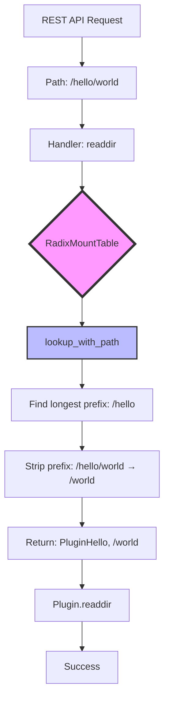
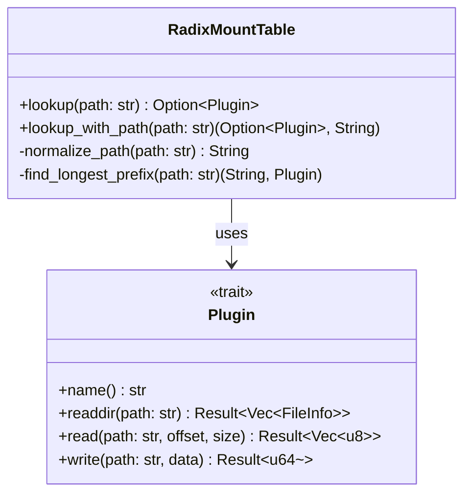
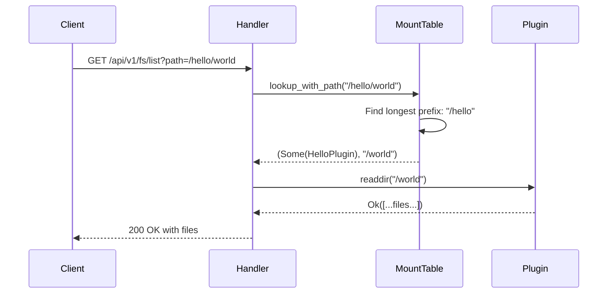

# VFS Path Translation Fix - Design Document

## 1. Overview

### Problem Statement
The EVIF file system has a critical bug in path translation between REST handlers and plugins. REST handlers pass absolute paths (e.g., `/hello`) to plugins, but plugins expect paths relative to their mount point (e.g., `/`). This causes all file operations to fail with "Path not found" errors.

### Root Cause
In `crates/evif-rest/src/handlers.rs:336`, the code does:
```rust
let plugin = state.mount_table.lookup(&params.path).await.ok_or(...)?;
plugin.readdir(&params.path).await  // BUG: passes absolute path
```

When UI requests `/hello`, the handler:
1. Looks up `/hello` → finds HelloFsPlugin
2. Calls `plugin.readdir("/hello")` ← BUG: plugin expects `readdir("/")`

### Solution Summary
Add a new method `lookup_with_path()` to `RadixMountTable` that returns both the plugin and the relative path with mount prefix stripped. Update all REST handlers to use this method.

## 2. Architecture Overview



## 3. Components and Interfaces

### 3.1 RadixMountTable Enhancement

**Location:** `crates/evif-core/src/radix_mount_table.rs`

**New Method:**
```rust
impl RadixMountTable {
    /// 查找插件并返回相对路径
    ///
    /// 返回 (插件, 相对路径) 元组
    /// - 插件: 如果找到挂载点则为 Some，否则为 None
    /// - 相对路径: 去除挂载前缀后的路径
    ///
    /// # 示例
    /// - `lookup_with_path("/hello")` → `(Some(plugin), "/")`
    /// - `lookup_with_path("/hello/world")` → `(Some(plugin), "/world")`
    /// - `lookup_with_path("/")` → `(None, "/")`
    /// - `lookup_with_path("/nonexistent")` → `(None, "")`
    pub async fn lookup_with_path(&self, path: &str)
        -> (Option<Arc<dyn EvifPlugin>>, String)
}
```

**Algorithm:**
1. Normalize input path using existing `normalize_path()`
2. Use longest prefix matching (same as current `lookup()`)
3. If found:
   - Extract mount point key that matched
   - Strip it from input path
   - Return `(Some(plugin), relative_path)`
4. If not found:
   - Return `(None, "")`

### 3.2 REST Handler Updates

**Location:** `crates/evif-rest/src/handlers.rs`

**Affected Handlers:**
- `readdir` - list directory contents
- `stat` - get file metadata
- `read` - read file content
- `write` - write file content
- `create` - create file
- `mkdir` - create directory
- `remove` - delete file/directory
- `rename` - move file/directory
- `symlink` - create symbolic link
- `readlink` - read symbolic link

**Change Pattern:**
```rust
// BEFORE (broken):
let plugin = state.mount_table.lookup(&params.path).await.ok_or(...)?;
plugin.readdir(&params.path).await

// AFTER (fixed):
let (plugin_opt, relative_path) = state.mount_table.lookup_with_path(&params.path).await;
let plugin = plugin_opt.ok_or(Error::NotFound(...))?;
plugin.readdir(&relative_path).await
```

## 4. Data Models

### 4.1 Method Signature



### 4.2 Return Value

```rust
pub type LookupResult = (
    Option<Arc<dyn EvifPlugin>>,  // Plugin if found
    String                         // Relative path (stripped of mount prefix)
);
```

## 5. Error Handling

### 5.1 Error Types

| Scenario | Return Value | Handler Action |
|----------|--------------|----------------|
| Path matches mount point | `(Some(plugin), "/relpath")` | Call plugin with relative path |
| Path is "/" | `(None, "/")` | Call `list_mounts()` for mount points |
| Path has no match | `(None, "")` | Return 404 NotFound |

### 5.2 Error Propagation



## 6. Testing Strategy

### 6.1 Unit Tests

**Location:** `crates/evif-core/src/radix_mount_table.rs` (add to existing test module)

**Test Cases:**
1. `test_lookup_with_path_root` - Root path returns None
2. `test_lookup_with_path_simple` - Simple mount point
3. `test_lookup_with_path_nested` - Nested paths
4. `test_lookup_with_path_nonexistent` - No match
5. `test_lookup_with_path_deep_nesting` - Deep path traversal
6. `test_lookup_with_path_nested_mounts` - Multiple nested mount points

### 6.2 Integration Tests

**Location:** `crates/evif-rest/tests/api_contract.rs`

**Test Scenarios:**
1. List root directory → returns mount points
2. List mounted plugin root → lists plugin contents
3. List nested directory → traverses correctly
4. Read file in nested path → succeeds
5. Create file in nested path → succeeds
6. Non-existent path → 404 error

### 6.3 E2E Tests

**Tool:** Playwright MCP

**Test Flows:**
1. Open UI → verify mount points appear
2. Click mount point → expand directory tree
3. Navigate nested folders → verify files appear
4. Create file → verify success
5. Read file → verify content

## 7. Implementation Phases

### Phase 1: Core Implementation
- Implement `lookup_with_path()` in RadixMountTable
- Add comprehensive unit tests
- Verify all test cases pass

### Phase 2: Handler Updates
- Update all REST handlers to use `lookup_with_path()`
- Update integration tests
- Verify API contracts

### Phase 3: E2E Validation
- Run Playwright tests
- Verify UI functionality end-to-end
- Fix any remaining issues

## 8. Appendices

### 8.1 Technology Choices

**Why enhance RadixMountTable instead of fixing in handlers?**
- **Pros:**
  - Single source of truth for path translation
  - Reusable across all handlers
  - Testable in isolation
  - Maintains O(k) performance
- **Cons:**
  - Requires modification to core data structure
  - Need to update all handlers

**Alternative Considered: Add path stripping logic in each handler**
- **Rejected because:**
  - Code duplication across 10+ handlers
  - Harder to test
  - Inconsistent implementations likely
  - Maintenance burden

### 8.2 Key Constraints

1. **Performance:** Must maintain O(k) lookup complexity
2. **Backward Compatibility:** Keep existing `lookup()` method
3. **Thread Safety:** Use existing RwLock locking patterns
4. **Path Normalization:** Reuse existing `normalize_path()`

### 8.3 Risks and Mitigations

| Risk | Impact | Mitigation |
|------|--------|------------|
| Path stripping logic error | HIGH - file operations fail | Comprehensive unit + integration tests |
| Performance regression | MEDIUM - slower API | Benchmark before/after |
| Breaking existing functionality | CRITICAL - UI breaks | E2E testing with Playwright |
| Edge case handling | MEDIUM - edge paths fail | Explicit edge case tests |

### 8.4 Performance Considerations

**Current Performance:**
- Lookup: O(k) where k = path length
- Radix Tree: Fast prefix matching

**After Change:**
- Same O(k) lookup complexity
- Additional string slice operation: O(1)
- Negligible performance impact

**Benchmark Targets:**
- 100 mount points: < 100μs per lookup
- 1000 mount points: < 500μs per lookup

### 8.5 Future Enhancements

1. **Path Caching:** Cache lookup results for hot paths
2. **Batch Operations:** Support batch path resolution
3. **Path Validation:** Add path security validation
4. **Metrics:** Track path resolution performance
